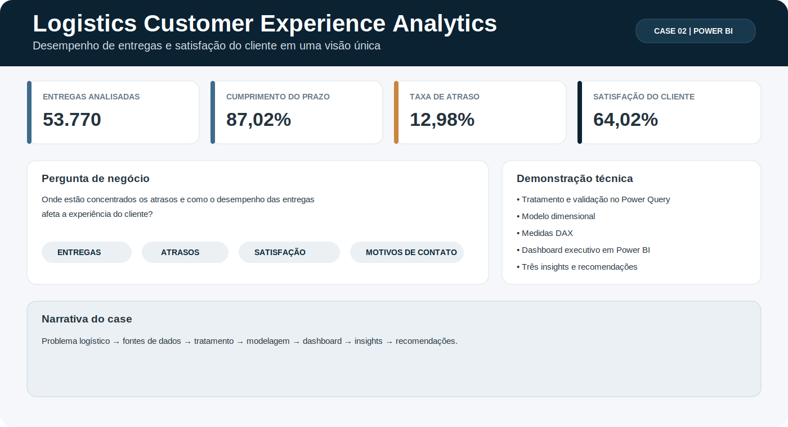

  

 

Profissional de **Data Analytics** com mais de 10 anos de experiência transformando dados operacionais em indicadores, análises de desempenho e recomendações para apoiar decisões em ambientes complexos.

Minha trajetória combina **Power BI, Excel, Power Query, DAX, governança de KPIs, visualização de dados e conhecimento de negócio**. Atuo na tradução de perguntas operacionais em métricas, dashboards, diagnósticos e recomendações acionáveis, conectando áreas de negócio, liderança e tecnologia.

*Data Analytics professional with 10+ years of experience turning operational data into performance indicators, business insights and actionable recommendations.*

## Competências em Data Analytics

- Análise de dados e Business Analytics
- Power BI, Excel, Power Query e DAX
- Definição, governança e análise de KPIs
- Visualização de dados e Data Storytelling
- Análise de desempenho, tendências, desvios e causas
- Tradução de necessidades de negócio em métricas e requisitos
- Qualidade de dados e padronização de informações
- Gestão de stakeholders e comunicação executiva

## Como estruturo uma análise

**Pergunta de negócio → entendimento dos dados → tratamento e validação → modelagem e métricas → visualização → insights → recomendação → decisão**

## Projetos selecionados

### [Logistics Customer Experience Analytics](projects/customer-experience-performance-analytics/README.md)

Case de uma empresa de logística com problemas de atraso e impacto na experiência do cliente.

O projeto conecta dados de entregas e registros de contato para identificar onde os atrasos estão concentrados, quais motivos aparecem com maior frequência e como o desempenho logístico afeta a satisfação.

**Foco técnico:** Power BI, Power Query, modelo dimensional, DAX, visualização e comunicação executiva.

- 53.770 entregas analisadas
- 87,02% de cumprimento do prazo
- 12,98% de taxa de atraso
- 64,02% de satisfação do cliente

> Projeto em desenvolvimento. A apresentação final terá apenas três insights e recomendações objetivas.

[Ver a construção do case](projects/customer-experience-performance-analytics/README.md)

### [SIM Mobile - Data Capture & Operational Analytics](https://github.com/KarineAssis/sim-mobile-case-study)

Case que demonstra como um problema de captura de dados afetava a qualidade das informações operacionais. A iniciativa aproximou o registro do local de execução e criou uma base mais favorável para análises confiáveis e tomada de decisão.

**Minha atuação:** diagnóstico do processo, jornada do usuário, requisitos funcionais, alinhamento com TI, testes, piloto, implantação, acompanhamento da adoção e definição de oportunidades analíticas.

- 5+ fluxos mobile disponibilizados
- 148 usuários habilitados até outubro de 2022
- 3 unidades brasileiras acompanhadas
- implantação iniciada em 2021

> Usuários habilitados não equivalem necessariamente a usuários ativos. O case explicita as limitações dos dados e evita atribuir resultados não comprovados.

[Ver o repositório do projeto](https://github.com/KarineAssis/sim-mobile-case-study)

## Experiência aplicada ao negócio

### Analytics e performance operacional

Experiência com indicadores de disponibilidade, MTTR, backlog, manutenção preventiva e preditiva, custos, planejamento e execução. Atuação com dashboards, reporting executivo, análise de tendências, identificação de desvios e priorização de ações.

### Projetos corporativos e atuação LATAM

Participação em iniciativas envolvendo unidades do Brasil, Equador e Argentina, conectando dados, processos, operação, liderança e tecnologia.

### Transformação digital e melhoria contínua

Experiência em mapeamento de processos, requisitos funcionais, testes, pilotos, implantação, gestão da mudança, PDCA, Kaizen e análise de causas.

## Ferramentas e métodos

### Aplicação prática

`Power BI` · `Excel` · `Power Query` · `DAX` · `KPIs` · `Data Visualization` · `Data Storytelling` · `Business Analytics` · `Análise de Processos` · `Requisitos Funcionais`

### Em desenvolvimento

`SQL` · `Python` · `Microsoft Fabric` · `Data Science`

### IA aplicada à produtividade analítica

`ChatGPT` · `Claude` · `Microsoft Copilot`

Uso para exploração de hipóteses, síntese de informações, documentação, estruturação de análises e comunicação executiva.

## Formação e idiomas

- Engenharia Mecânica - UFRN
- MBA em Gestão da Manutenção - IPOG
- Programa Profissional em Data Science - em andamento
- Português nativo
- Inglês C1
- Espanhol C1
- Alemão A2

## Contato

- [LinkedIn](https://www.linkedin.com/in/karine-dos-anjos-176ab4127/)
- [GitHub](https://github.com/KarineAssis)
