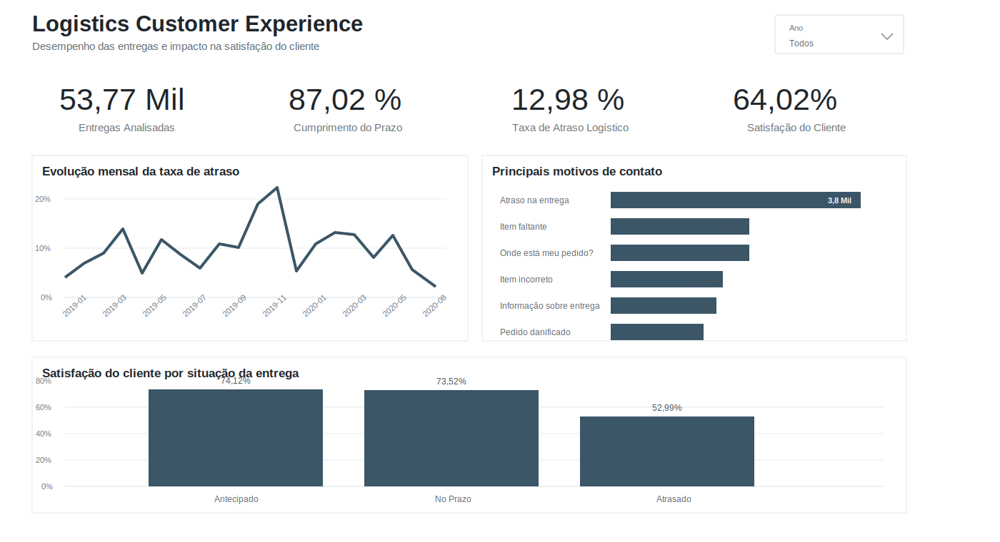
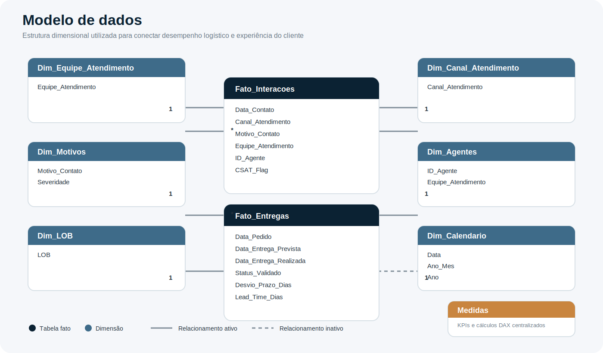

# Logistics Customer Experience Analytics

**Power BI aplicado ao desempenho logístico e à experiência do cliente**

<div align="center">
  
</div>

<div align="center">
  <a href="files/Logistics_Customer_Experience_Analytics_FINAL.pbix?raw=1">
    
  </a>
  &nbsp;
  <a href="../../Logistics_Customer_Experience_Analytics_FINAL.pdf?raw=1">
    
  </a>
</div>

## O problema

Uma empresa de logística precisava entender onde os atrasos estavam concentrados e como o desempenho das entregas se relacionava com a satisfação do cliente.

A análise reuniu duas fontes sintéticas:

- **53.770 entregas**;
- **16.318 registros de contato**.

> **Pergunta central:** onde estão os principais atrasos e qual é o impacto percebido pelo cliente?

## Dashboard final

<div align="center">
  
</div>

## Principais resultados

- **87,02%** das entregas foram concluídas no prazo ou antecipadamente;
- a taxa geral de atraso foi de **12,98%**;
- atraso na entrega foi o principal motivo de contato, com cerca de **3,8 mil registros**;
- a satisfação caiu para **52,99%** nas entregas atrasadas, contra mais de **73%** nas entregas cumpridas.

## Recomendações

- acompanhar a taxa de atraso mensalmente e investigar aumentos fora do padrão;
- priorizar as causas que concentram atrasos e contatos dos clientes;
- comunicar o cliente de forma proativa quando houver risco de descumprimento do prazo.

## Construção técnica

As fontes em Excel e CSV foram tratadas no **Power Query**, com correção de tipos e localidade das datas, criação de chave técnica e cálculo de lead time, desvio de prazo e status validado.

O modelo conecta duas tabelas fato — `Fato_Entregas` e `Fato_Interacoes` — às dimensões de calendário, motivos, canais, equipes e agentes. Os relacionamentos principais seguem cardinalidade **um para muitos**.

### Modelo de dados no Power BI

<div align="center">
  
</div>

### Exemplos de medidas DAX

```DAX
Taxa de Atraso =
DIVIDE(
    [Entregas Atrasadas],
    [Total Entregas],
    0
)
```

```DAX
Total Entregas Realizadas =
CALCULATE(
    [Total Entregas],
    USERELATIONSHIP(
        Fato_Entregas[Data_Entrega_Realizada],
        Dim_Calendario[Data]
    )
)
```

## Entregáveis disponíveis

- relatório final em Power BI (`.pbix`);
- versão executiva do dashboard em PDF;
- documentação do problema, metodologia, modelo, indicadores e implementação técnica;
- exemplos das principais medidas DAX e etapas de tratamento no Power Query.

## Documentação técnica

- [Problema de negócio e metodologia](docs/business-problem-and-methodology.md)
- [Modelo e indicadores](docs/model-metrics-and-rules.md)
- [Implementação técnica](docs/technical-implementation.md)

## Rastreabilidade da análise

**Fonte → tratamento → modelo → métrica → visual → interpretação → recomendação**

As regras de transformação e cálculo estão documentadas para permitir que o avaliador relacione cada resultado apresentado no dashboard às etapas de preparação e modelagem dos dados.

## Limitações

Os dados são sintéticos e não representam uma empresa real. A relação entre atraso e satisfação indica associação, não causalidade.
