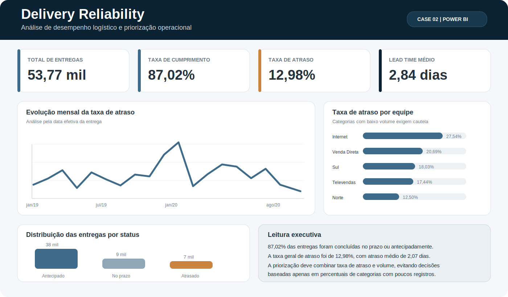

# Delivery Reliability

**Case 02 — Análise de desempenho logístico e priorização operacional**

  

> Projeto em desenvolvimento. Esta página documenta a construção do case e será atualizada à medida que as próximas etapas forem concluídas.

## Visão geral

Este projeto analisa a confiabilidade de uma operação logística a partir de dados de pedidos, prazos previstos e entregas realizadas.

O objetivo é responder:

- Qual é o nível geral de cumprimento do prazo?
- Onde os atrasos estão concentrados?
- Quais equipes, canais, cidades ou períodos devem ser priorizados?
- Como diferenciar uma taxa alta causada por poucos registros de um problema com impacto operacional relevante?

## Indicadores atuais

| Indicador | Resultado |
|---|---:|
| Total de entregas | 53.770 |
| Entregas antecipadas | 38.021 |
| Entregas no prazo | 8.772 |
| Entregas atrasadas | 6.977 |
| Taxa de cumprimento | 87,02% |
| Taxa de atraso | 12,98% |
| Lead time médio | 2,84 dias |
| Atraso médio | 2,07 dias |

## Abordagem analítica

**Pergunta de negócio → auditoria dos dados → tratamento e validação → modelagem → medidas DAX → visualização → insights → priorização**

## Etapas concluídas

### 1. Auditoria no Excel

- 53.770 registros e 11 campos originais;
- ausência de valores nulos;
- ausência de duplicatas exatas;
- identificação de IDs de pedido repetidos;
- validação da consistência entre datas e status;
- criação de dicionário de dados.

### 2. Tratamento no Power Query

- conversão das datas com localidade adequada;
- criação de uma chave técnica por entrega;
- cálculo de lead time;
- cálculo do desvio em relação ao prazo;
- recálculo do status;
- validação da consistência do status original.

### 3. Modelagem no Power BI

- tabela fato de entregas;
- dimensão calendário;
- relacionamento ativo pela data do pedido;
- relacionamentos inativos para data prevista e data realizada;
- medidas temporais com `USERELATIONSHIP`.

### 4. Indicadores e visualização

- total de entregas;
- taxa de cumprimento;
- taxa de atraso;
- lead time médio;
- atraso médio;
- evolução mensal;
- comparação por equipe;
- distribuição por status.

## Ferramentas

`Excel` · `Power Query` · `Power BI` · `DAX`

As próximas etapas adicionarão consultas em `SQL`, análise exploratória em `Python` e documentação técnica complementar.

## Decisões analíticas importantes

- O ID do pedido não foi usado isoladamente como chave porque apresenta repetições.
- O status foi recalculado a partir das datas para validar a classificação original.
- Taxa de atraso e impacto absoluto serão analisados separadamente.
- Categorias com volume muito baixo não serão tratadas como prioridade apenas por apresentarem percentuais elevados.

## Próximas etapas

- aprofundar a análise por equipe, canal, cidade e vendedor;
- construir uma matriz de volume versus taxa de atraso;
- desenvolver análise de Pareto;
- criar ranking de prioridade operacional;
- consolidar insights e recomendações;
- adicionar SQL e Python;
- publicar a versão final do dashboard e do case executivo.

## Observação

A base foi utilizada para fins educacionais e de portfólio. O case foi reconstruído com nova pergunta de negócio, auditoria, tratamento, modelagem, indicadores e narrativa analítica próprios.
