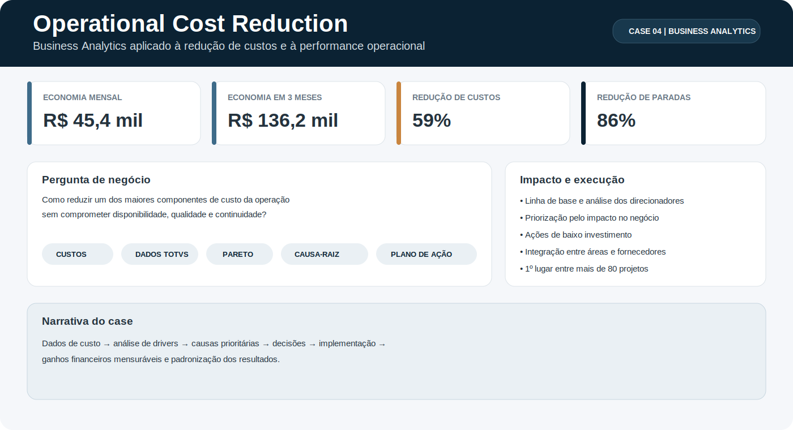

# Operational Cost Reduction

**Case 04 — Business Analytics e melhoria contínua aplicados à redução de custos operacionais**

  

## Executive snapshot

Um dos maiores componentes de custo de uma operação industrial apresentava gastos recorrentes, paradas corretivas e impactos indiretos em qualidade e logística.

O projeto conectou dados históricos do **TOTVS**, análise de custos, Pareto, investigação de causas e execução de ações de baixo investimento para transformar um problema operacional em resultado financeiro mensurável.

> **Pergunta central:** como reduzir um custo relevante para o negócio sem comprometer disponibilidade, qualidade e continuidade operacional?

## Impacto para o negócio

- **R$ 45,4 mil de economia mensal**;
- **R$ 136,2 mil economizados em três meses**;
- **59% de redução no custo médio mensal**, de R$ 76,6 mil para R$ 31,3 mil;
- **86% de redução no tempo médio de paradas corretivas**;
- **1º lugar entre mais de 80 projetos** de melhoria contínua da empresa no Brasil.

## Abordagem analítica

1. Construção da linha de base com dados históricos de custos;
2. estratificação dos principais direcionadores e aplicação de Pareto;
3. investigação das causas com dados, observação do processo e participação das áreas envolvidas;
4. priorização das oportunidades pelo impacto no negócio;
5. implantação de melhorias em especificações, critérios de decisão, processo e fornecedores;
6. verificação dos resultados e padronização para sustentar os ganhos.

## Decisões implementadas

- revisão de especificações e critérios técnicos de aquisição e substituição;
- desenvolvimento de alternativas com maior vida útil e menor custo total;
- criação de critérios padronizados para decisões operacionais;
- alinhamento entre operação, engenharia, suprimentos e fornecedores;
- atualização de documentos, treinamento das equipes e acompanhamento dos resultados.

## Minha contribuição

Atuei na estruturação do problema, análise dos dados, investigação das causas, construção e acompanhamento do plano de ação, articulação com stakeholders e mensuração dos resultados.

O case demonstra a capacidade de conectar **dados, conhecimento de negócio, gestão de stakeholders e execução** para gerar impacto financeiro real.

## Métodos e competências

`Business Analytics` · `Cost Analysis` · `TOTVS` · `Pareto` · `Root Cause Analysis` · `MASP` · `PDCA` · `Kaizen` · `5W2H` · `Gestão de Stakeholders` · `Padronização`

---

*Case baseado em um projeto real realizado em 2019. A apresentação foi reestruturada para o portfólio e preserva informações internas e detalhes operacionais sensíveis.*
