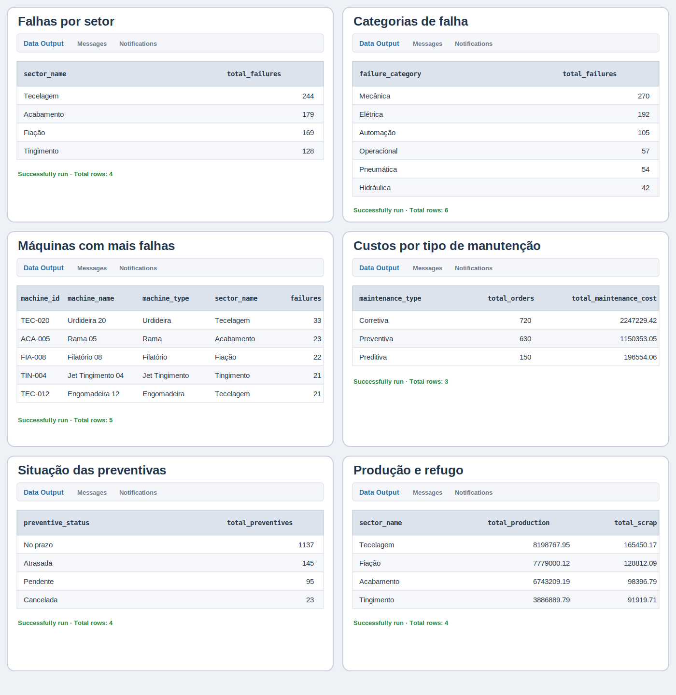

# SQL Maintenance Analytics

**Case 03 — SQL aplicado à análise de manutenção industrial**

<div align="center">
  
</div>

## O problema

Uma indústria têxtil fictícia precisava organizar seus dados de manutenção e identificar onde estavam concentradas as principais falhas, os maiores custos e as oportunidades de melhoria no plano preventivo.

A análise reuniu informações de quatro setores produtivos — **Fiação, Tecelagem, Tingimento e Acabamento** — em um banco relacional no PostgreSQL.

> **Pergunta central:** Como os dados de máquinas, falhas, ordens de manutenção, paradas, preventivas e produção apoiam a priorização das ações de manutenção?

## Escopo dos dados

A base representa dois anos de operação, entre janeiro de 2024 e dezembro de 2025.

- **4** setores produtivos;
- **60** máquinas cadastradas;
- **720** eventos de falha;
- **1.500** ordens de manutenção;
- **600** eventos de parada;
- **1.400** registros de manutenção preventiva;
- **43.860** registros de produção diária;
- **48.144 registros no total**.

Os dados são **sintéticos** e não representam uma empresa real. A base foi gerada programaticamente para fins educacionais, respeitando relações coerentes entre máquinas, falhas, ordens, paradas, preventivas e produção.

## Estrutura do banco

O banco `textile_maintenance` foi criado no PostgreSQL e organizado no schema `maintenance`.

- `sectors` — cadastro dos setores produtivos;
- `machines` — cadastro das máquinas;
- `failure_events` — histórico de falhas;
- `maintenance_orders` — ordens preventivas, corretivas e preditivas;
- `downtime_events` — paradas planejadas e não planejadas;
- `preventive_maintenance` — planejamento e execução das preventivas;
- `production_daily` — produção, horas operacionais e refugo.

### Relacionamentos principais

```text
sectors (1) ────< machines
machines (1) ────< failure_events
machines (1) ────< maintenance_orders
machines (1) ────< downtime_events
machines (1) ────< preventive_maintenance
machines (1) ────< production_daily
failure_events (1) ────< maintenance_orders
failure_events (1) ────< downtime_events
```

## Construção técnica

O projeto foi desenvolvido em cinco etapas:

1. organização dos arquivos CSV;
2. criação do banco e das tabelas no PostgreSQL;
3. importação dos dados pelo pgAdmin;
4. validação das quantidades e dos relacionamentos;
5. desenvolvimento das consultas de análise.

Os principais recursos utilizados foram:

```sql
SELECT
FROM
WHERE
ORDER BY
LIMIT
COUNT
SUM
AVG
ROUND
GROUP BY
INNER JOIN
LEFT JOIN
CASE
NULLIF
```

### Exemplo de consulta

```sql
SELECT
    s.sector_name,
    COUNT(f.failure_id) AS total_failures
FROM maintenance.failure_events AS f
INNER JOIN maintenance.machines AS m
    ON f.machine_id = m.machine_id
INNER JOIN maintenance.sectors AS s
    ON m.sector_id = s.sector_id
GROUP BY
    s.sector_name
ORDER BY
    total_failures DESC;
```

## Resultados executados no pgAdmin

Os valores e os nomes das colunas apresentados abaixo foram extraídos das consultas executadas no PostgreSQL por meio do pgAdmin. A visualização reproduz o padrão do painel **Data Output**, enquanto os scripts originais permanecem disponíveis na pasta [`sql`](sql/).

<div align="center">
  
</div>

## Principais conclusões

### Falhas por setor

A **Tecelagem** apresentou 244 falhas, seguida por Acabamento, com 179; Fiação, com 169; e Tingimento, com 128. O resultado representa volume absoluto e deve ser interpretado em conjunto com a quantidade de máquinas de cada setor.

### Categorias mais frequentes

As falhas **mecânicas** foram as mais frequentes, com 270 ocorrências, seguidas pelas falhas elétricas, com 192. Automação registrou 105 ocorrências, enquanto as categorias operacional, pneumática e hidráulica apresentaram volumes menores.

### Máquinas com mais falhas

A máquina `TEC-020` — Urdideira 20 — apresentou 33 falhas e se destacou como candidata prioritária para investigação de causas recorrentes e revisão do plano preventivo.

Na sequência apareceram `ACA-005`, com 23 falhas; `FIA-008`, com 22; e `TIN-004` e `TEC-012`, ambas com 21 ocorrências.

### Custos por tipo de manutenção

A manutenção **corretiva** apresentou o maior volume e o maior custo acumulado: 720 ordens e R$ 2.247.229,42. A preventiva totalizou 630 ordens e R$ 1.150.353,05, enquanto a preditiva registrou 150 ordens e R$ 196.554,06.

### Situação das preventivas

Foram registradas 1.137 preventivas realizadas no prazo. Entretanto, 145 estavam atrasadas, 95 pendentes e 23 canceladas, totalizando **263 atividades fora da condição esperada**.

### Produção e refugo

A Tecelagem apresentou a maior produção acumulada, com 8.198.767,95, e também o maior volume absoluto de refugo, com 165.450,17. Para uma avaliação mais precisa, o refugo deve ser analisado proporcionalmente ao volume produzido por setor.

## Recomendações

- priorizar a investigação da Urdideira `TEC-020` e das demais máquinas com alta recorrência;
- aprofundar as causas das falhas mecânicas e elétricas;
- acompanhar o custo das ordens corretivas e os equipamentos que mais contribuem para esse valor;
- atuar sobre preventivas atrasadas e pendentes;
- avaliar o refugo proporcionalmente ao volume produzido por setor.

## Arquivos do projeto

### Scripts SQL

1. [`01_create_tables.sql`](sql/01_create_tables.sql) — criação do schema, tabelas, restrições e índices;
2. [`02_validate_data.sql`](sql/02_validate_data.sql) — validação das quantidades importadas;
3. [`03_machine_sector_join.sql`](sql/03_machine_sector_join.sql) — relacionamento entre máquinas e setores;
4. [`04_basic_analysis.sql`](sql/04_basic_analysis.sql) — análises iniciais do cadastro de máquinas;
5. [`05_failure_analysis.sql`](sql/05_failure_analysis.sql) — análise de falhas e severidade;
6. [`06_maintenance_orders_analysis.sql`](sql/06_maintenance_orders_analysis.sql) — ordens e custos de manutenção;
7. [`07_downtime_analysis.sql`](sql/07_downtime_analysis.sql) — paradas e horas de indisponibilidade;
8. [`08_preventive_maintenance_analysis.sql`](sql/08_preventive_maintenance_analysis.sql) — execução e pendências das preventivas;
9. [`09_production_analysis.sql`](sql/09_production_analysis.sql) — produção, horas operacionais e refugo;
10. [`10_project_summary.sql`](sql/10_project_summary.sql) — consultas utilizadas para consolidar os principais resultados.

### Dados

- [`data/README.md`](data/README.md) — documentação da base e dos volumes utilizados;
- [`01_sectors.csv`](data/01_sectors.csv) — cadastro completo de setores;
- [`02_machines.csv`](data/02_machines.csv) — cadastro completo de máquinas;
- [`data/samples`](data/samples/) — amostras das tabelas de maior volume.

Os resultados apresentados foram calculados sobre a base completa importada no PostgreSQL. As amostras publicadas permitem visualizar a estrutura dos dados sem tornar o repositório excessivamente pesado.

## Limitações e próximos passos

Nesta versão, o projeto não calcula indicadores como MTTR, MTBF e disponibilidade. Essas métricas poderão ser incorporadas em uma evolução futura, junto com análises mensais, dashboard em Power BI e dados de sensores para manutenção preditiva.

## Tecnologias

`SQL` · `PostgreSQL` · `pgAdmin` · `CSV`
