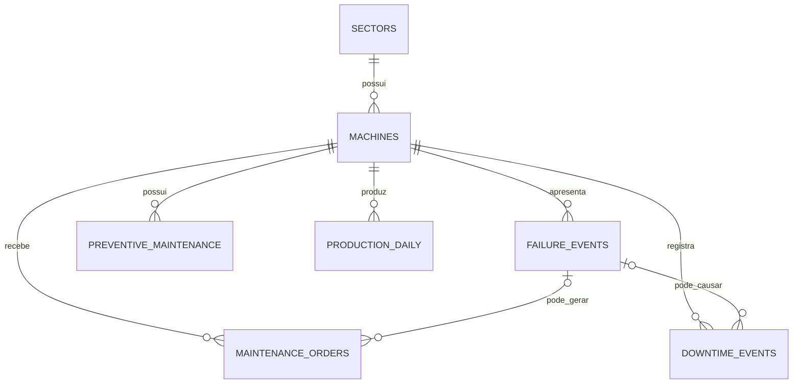

# SQL Maintenance Analytics

**Case 03 — SQL aplicado à análise de manutenção industrial**

<div align="center">
  
</div>

## O problema

Uma indústria têxtil fictícia precisava organizar seus dados de manutenção e identificar onde estavam concentradas as principais falhas, os maiores custos e as oportunidades de melhoria no plano preventivo.

A análise reuniu informações de quatro setores produtivos — **Fiação, Tecelagem, Tingimento e Acabamento** — em um banco relacional no PostgreSQL.

> **Pergunta central:** como os dados de máquinas, falhas, ordens de manutenção, paradas, preventivas e produção podem apoiar a priorização das ações de manutenção?

## Escopo dos dados

A base representa dois anos de operação, entre janeiro de 2024 e dezembro de 2025.

| Informação | Quantidade |
|---|---:|
| Setores | 4 |
| Máquinas | 60 |
| Eventos de falha | 720 |
| Ordens de manutenção | 1.500 |
| Eventos de parada | 600 |
| Registros de manutenção preventiva | 1.400 |
| Registros de produção diária | 43.860 |
| **Total de registros** | **48.144** |

Os dados são **sintéticos** e não representam uma empresa real. A base foi gerada programaticamente para fins educacionais, respeitando relações coerentes entre máquinas, falhas, ordens, paradas, preventivas e produção.

## Estrutura do banco

O banco `textile_maintenance` foi criado no PostgreSQL com sete tabelas principais, organizadas no schema `maintenance`:

| Tabela | Finalidade |
|---|---|
| `sectors` | Cadastro dos setores produtivos |
| `machines` | Cadastro das máquinas |
| `failure_events` | Histórico de falhas |
| `maintenance_orders` | Ordens preventivas, corretivas e preditivas |
| `downtime_events` | Paradas planejadas e não planejadas |
| `preventive_maintenance` | Planejamento e execução das preventivas |
| `production_daily` | Produção, horas operacionais e refugo |



## Construção técnica

O projeto foi desenvolvido em cinco etapas:

1. organização dos arquivos CSV;
2. criação do banco e das tabelas no PostgreSQL;
3. importação dos dados pelo pgAdmin;
4. validação das quantidades e dos relacionamentos;
5. desenvolvimento das consultas de análise.

Os principais recursos utilizados foram:

```sql
SELECT
FROM
WHERE
ORDER BY
LIMIT
COUNT
SUM
AVG
ROUND
GROUP BY
INNER JOIN
LEFT JOIN
CASE
NULLIF
```

### Exemplo de consulta

```sql
SELECT
    s.sector_name,
    COUNT(f.failure_id) AS total_failures
FROM maintenance.failure_events AS f
INNER JOIN maintenance.machines AS m
    ON f.machine_id = m.machine_id
INNER JOIN maintenance.sectors AS s
    ON m.sector_id = s.sector_id
GROUP BY
    s.sector_name
ORDER BY
    total_failures DESC;
```

## Principais resultados

### Falhas por setor

| Setor | Total de falhas |
|---|---:|
| Tecelagem | 244 |
| Acabamento | 179 |
| Fiação | 169 |
| Tingimento | 128 |

A Tecelagem apresentou o maior volume absoluto de falhas. O resultado deve ser interpretado em conjunto com o número de máquinas, pois esse também é o setor com mais equipamentos na base.

### Categorias mais frequentes

| Categoria | Total de falhas |
|---|---:|
| Mecânica | 270 |
| Elétrica | 192 |
| Automação | 105 |
| Operacional | 57 |
| Pneumática | 54 |
| Hidráulica | 42 |

Falhas mecânicas e elétricas concentraram a maior parte das ocorrências.

### Máquinas com mais falhas

| Máquina | Equipamento | Setor | Falhas |
|---|---|---|---:|
| TEC-020 | Urdideira 20 | Tecelagem | 33 |
| ACA-005 | Rama 05 | Acabamento | 23 |
| FIA-008 | Filatório 08 | Fiação | 22 |
| TIN-004 | Jet de Tingimento 04 | Tingimento | 21 |
| TEC-012 | Engomadeira 12 | Tecelagem | 21 |

A `TEC-020` se destacou como candidata prioritária para investigação de causas recorrentes e revisão do plano preventivo.

### Custos por tipo de manutenção

| Tipo | Ordens | Custo total |
|---|---:|---:|
| Corretiva | 720 | R$ 2.247.229,42 |
| Preventiva | 630 | R$ 1.150.353,05 |
| Preditiva | 150 | R$ 196.554,06 |

A manutenção corretiva apresentou o maior volume de ordens e o maior custo acumulado.

### Situação das preventivas

| Status | Quantidade |
|---|---:|
| No prazo | 1.137 |
| Atrasada | 145 |
| Pendente | 95 |
| Cancelada | 23 |

A maior parte das atividades foi executada no prazo. Entretanto, **263 preventivas** estavam atrasadas, pendentes ou canceladas.

### Produção e refugo

| Setor | Produção | Refugo |
|---|---:|---:|
| Tecelagem | 8.198.767,95 | 165.450,17 |
| Fiação | 7.779.000,12 | 128.812,09 |
| Acabamento | 6.743.209,19 | 98.396,79 |
| Tingimento | 3.886.889,79 | 91.919,71 |

A Tecelagem apresentou a maior produção e também o maior volume absoluto de refugo.

## Recomendações

- priorizar a investigação da Urdideira `TEC-020` e das demais máquinas com alta recorrência;
- aprofundar as causas das falhas mecânicas e elétricas;
- acompanhar o custo das ordens corretivas e os equipamentos que mais contribuem para esse valor;
- atuar sobre preventivas atrasadas e pendentes;
- avaliar o refugo proporcionalmente ao volume produzido por setor.

## Arquivos do projeto

- [`10_project_summary.sql`](sql/10_project_summary.sql) — consultas utilizadas para consolidar os principais resultados.

Os demais scripts e arquivos de dados serão adicionados à medida que a documentação do projeto for consolidada.

## Limitações e próximos passos

Nesta versão, o projeto não calcula indicadores como MTTR, MTBF e disponibilidade. Essas métricas poderão ser incorporadas em uma evolução futura, junto com análises mensais, dashboard em Power BI e dados de sensores para manutenção preditiva.

## Tecnologias

`SQL` · `PostgreSQL` · `pgAdmin` · `CSV`
